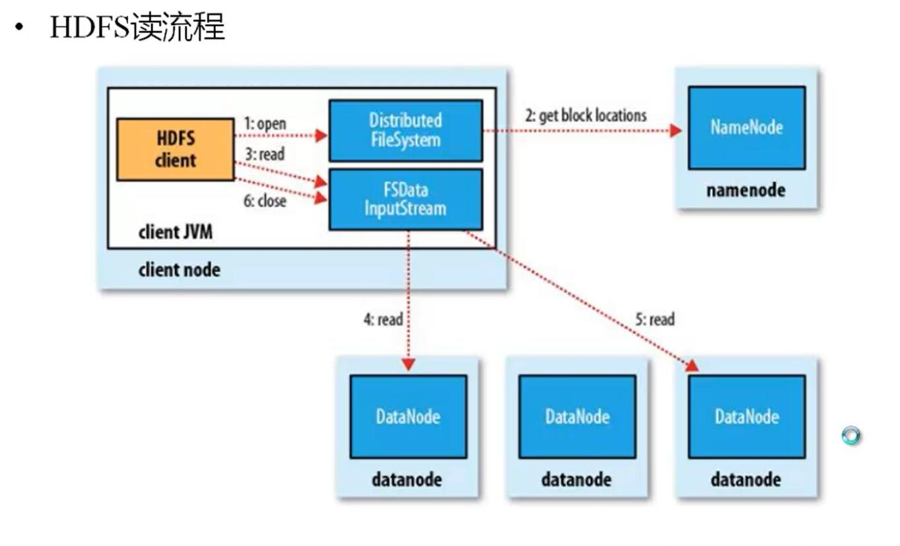
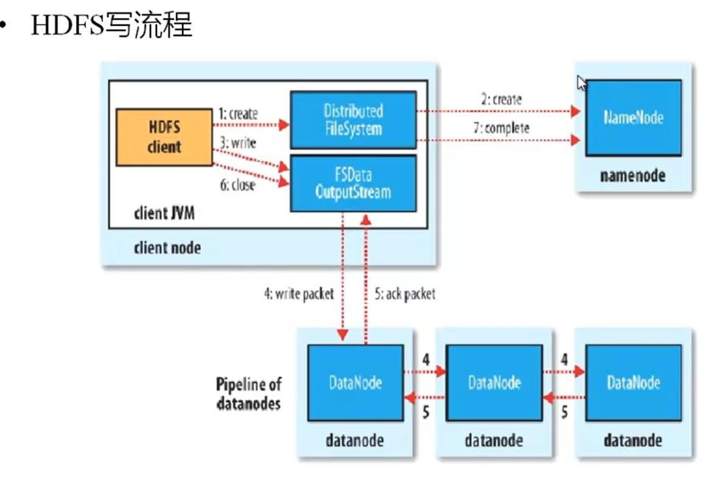

# hdfs 读写流程

### hdfs 读数据

## hdfs 读写示例

    package org.support.dfs.hdfs;

    import org.apache.hadoop.conf.Configuration;
    import org.apache.hadoop.fs.*;
    import org.apache.hadoop.security.UserGroupInformation;
    import org.junit.Test;

    import java.io.File;
    import java.io.FileInputStream;
    import java.io.FileOutputStream;
    import java.io.IOException;

    public class HdfsTest {

        @Test
        public void upload2() throws IOException {
            Configuration entries = new Configuration();
            entries.set("fs.defaultFS", "hdfs://192.168.1.122:9000");
            entries.set("hadoop.security.authentication", "simple");

            UserGroupInformation.setConfiguration(entries);

            FileSystem fileSystem = FileSystem.get(entries);

            Path basePath = new Path("/");

            FSDataOutputStream stream = fileSystem.create(new Path("/zhanzgq/lcm/love.png"));

            FileInputStream fin = new FileInputStream(new File("D:\\dektop\\dektop.jpg"));

            int len = 0;
            byte[] data = new byte[2048];
            while ((len = fin.read(data)) != -1) {
                stream.write(data, 0, len);
            }
            stream.flush();

        }

        @Test
        public void download() throws IOException {
            Configuration entries = new Configuration();
            entries.set("fs.defaultFS", "hdfs://192.168.1.122:9000");
            entries.set("hadoop.security.authentication", "simple");

            UserGroupInformation.setConfiguration(entries);

            FileSystem fileSystem = FileSystem.get(entries);

            Path filePath = new Path("/zhanzgq/lcm/love.png");

            FSDataInputStream fsDataInputStream = fileSystem.open(filePath);

            FileOutputStream fos = new FileOutputStream(new File("D:\\dektop\\love.jpg"));

            int len = 0;
            byte[] data = new byte[2048];
            while ((len = fsDataInputStream.read(data)) != -1) {
                fos.write(data, 0, len);
            }
            fos.flush();

            System.out.println("下载完毕! " + filePath.getName());

        }

    }
