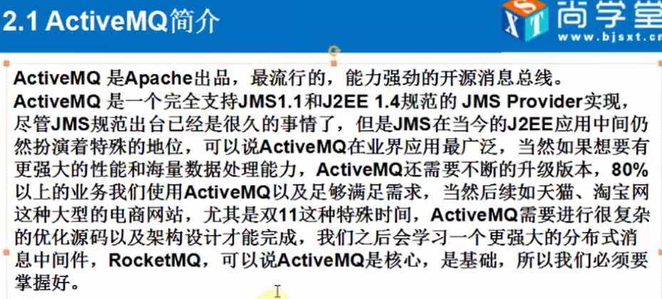
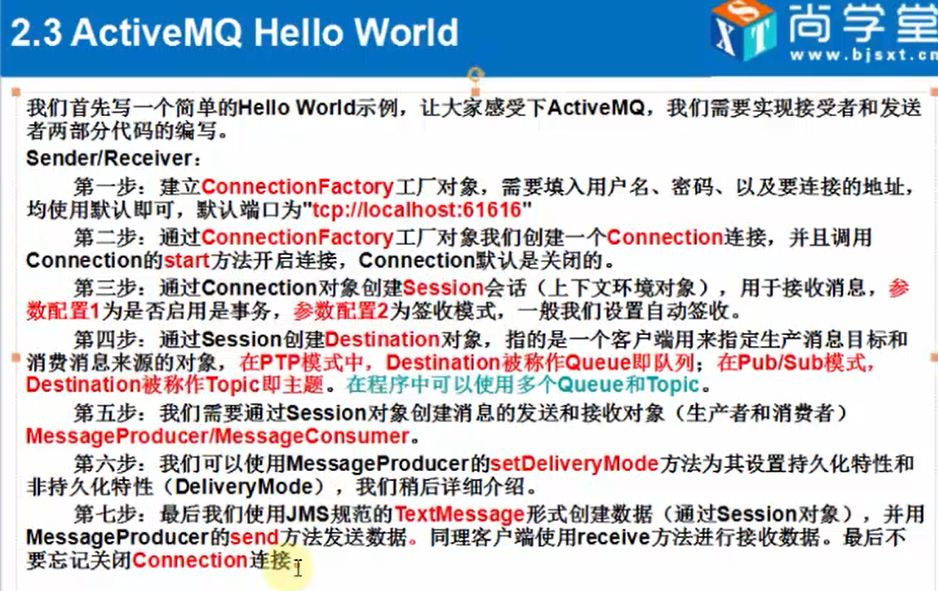

# activemq基本了解和入门helloword

### Activemq 简介

### activemq 下载

* http://activemq.apache.org/components/classic/download/ 下载最新版即可

* 默认管理员用户名admin，密码admin，该配置可以在 jetty-realm。perperties 文件里面修改

* 更多配置清看下载完毕的文件解压包里面的 conf 里面的配置

### 启动activemq

* 进入 bin 目录，打开64位，点击 activemq.bat

* 不出意外，此时就可以打开 http://localhost:8161 进入mq管理页面了

### hello word

### producer

    package zzq.activemq.hw;

    import org.apache.activemq.ActiveMQConnectionFactory;
    import org.slf4j.Logger;
    import org.slf4j.LoggerFactory;

    import javax.jms.*;
    import java.util.Date;
    import java.util.concurrent.ScheduledThreadPoolExecutor;
    import java.util.concurrent.TimeUnit;

    public class Sender {

        private static Logger LOG = LoggerFactory.getLogger(Sender.class);

        public static void main(String[] args) throws Exception {
            // 第一步，创建ConnectionFactory工厂对象
            ActiveMQConnectionFactory factory = new ActiveMQConnectionFactory(
                    "admin","admin","tcp://localhost:61616"
            );

            // 第二步，通过ConnectionFactory工厂对象创建一个链接对象，并调用 Connection 的 start 方法开启链接
            Connection connection = factory.createConnection();
            connection.start();

            // 第三步，通过Connection对象创建Session会话(上下文环境对象)，用于接收消息，参数配置1为是否启用是事务，参数配置2为签收模式，一般我们设置自动签收。
            Session session = connection.createSession(Boolean.FALSE, Session.AUTO_ACKNOWLEDGE);

            //第四步，通过Session创建Destination对象，指的是-一个客户端用来指定生产消息目标和"消费消息来源的对象，在PTP模式中，Destination被称作Queue即队列;在Pub/Sub模式，Destination被称作Topic即主题。在程序中可以使用多个Queue和Topic。
            Queue queue = session.createQueue("default-queue");

            //第五步，我们需要通过Session对象创建消息的发送和接收对象(生产者和消费者)MessageProducerMessageConsumer.
            MessageProducer producer = session.createProducer(queue);

            //第六步，我们可以使用MessageProducer的setDeliveryMode方法为其设置持久化特性和非持久化特性( DeliveryMode)，我们稍后详细介绍。
            producer.setDeliveryMode(DeliveryMode.NON_PERSISTENT);

            ///第七步，最后我们使用JMS规范的TextMessage形式创建数据(通过Session对象)，并用MessageProducer的send方法发送数据。同理客户端使用receive方法进行接收数据。最后不要忘记关闭Connection连接
            TextMessage textMessage = session.createTextMessage("hello activemq");

            producer.send(textMessage);

            ScheduledThreadPoolExecutor scheduledThreadPoolExecutor = new ScheduledThreadPoolExecutor(2);
            scheduledThreadPoolExecutor.scheduleAtFixedRate(new Runnable() {
                @Override
                public void run() {
                    try {
                        TextMessage message = session.createTextMessage("现在时间：" + new Date());
                        producer.send(message);

                        LOG.info("消息发送成功："+message.getText());
                    } catch (JMSException e) {
                        e.printStackTrace();
                    }
                }
            } , 5 , 10 , TimeUnit.SECONDS);

        }

    }

### consume

    package zzq.activemq.hw;

    import org.apache.activemq.ActiveMQConnectionFactory;
    import org.slf4j.Logger;
    import org.slf4j.LoggerFactory;

    import javax.jms.*;
    import java.util.Date;
    import java.util.concurrent.ScheduledThreadPoolExecutor;
    import java.util.concurrent.TimeUnit;

    public class Consume {

        private static Logger LOG = LoggerFactory.getLogger(Consume.class);

        public static void main(String[] args) throws Exception {
            // 第一步，创建ConnectionFactory工厂对象
            ActiveMQConnectionFactory factory = new ActiveMQConnectionFactory(
                    "admin","admin","tcp://localhost:61616"
            );

            // 第二步，通过ConnectionFactory工厂对象创建一个链接对象，并调用 Connection 的 start 方法开启链接
            Connection connection = factory.createConnection();
            connection.start();

            // 第三步，通过Connection对象创建Session会话(上下文环境对象)，用于接收消息，参数配置1为是否启用是事务，参数配置2为签收模式，一般我们设置自动签收。
            Session session = connection.createSession(Boolean.FALSE, Session.AUTO_ACKNOWLEDGE);

            //第四步，通过Session创建Destination对象，指的是-一个客户端用来指定生产消息目标和"消费消息来源的对象，在PTP模式中，Destination被称作Queue即队列;在Pub/Sub模式，Destination被称作Topic即主题。在程序中可以使用多个Queue和Topic。
            Queue queue = session.createQueue("default-queue");

            //第五步，我们需要通过Session对象创建消息的发送和接收对象(生产者和消费者)MessageProducerMessageConsumer.
            MessageConsumer consumer = session.createConsumer(queue);

            while (true){
                TextMessage receive = (TextMessage) consumer.receive();
                if (receive==null){
                    break;
                }
                LOG.info("收到消息：" + receive.getText());
            }

            LOG.info("程序结束！");
        }

    }
