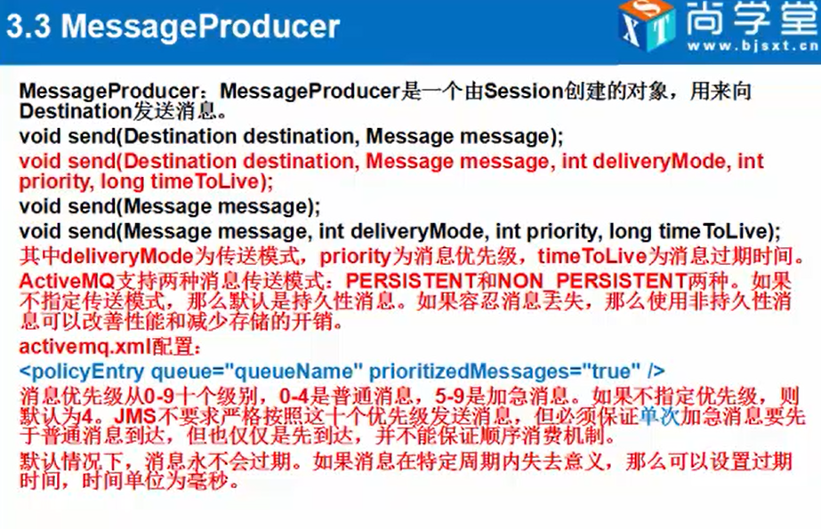
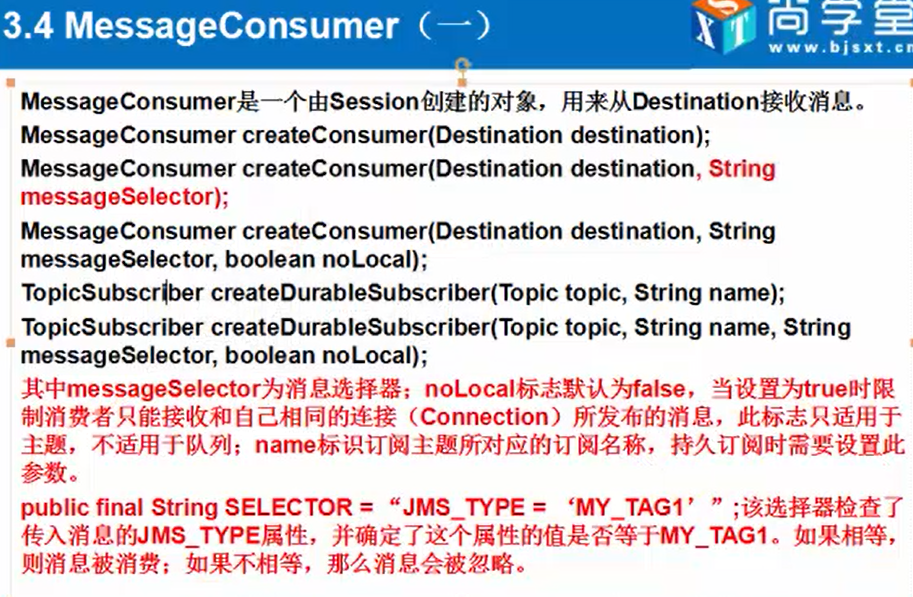

# produce-consume-介绍

#### MessageProduce

#### MessageConsume

#### produce 代码

    package zzq.activemq.hw02;

    import org.apache.activemq.ActiveMQConnectionFactory;
    import org.slf4j.Logger;
    import org.slf4j.LoggerFactory;

    import javax.jms.*;

    public class Sender {

        private static Logger LOGGER = LoggerFactory.getLogger(Sender.class);

        // 创建ConnectionFactory 对象
        private ActiveMQConnectionFactory connectionFactory;
        // 创建链接对象
        private Connection connection;
        // 获取 session 对象
        private Session session;
        // 从session里面获取生产者
        private MessageProducer producer;
        // 使用session创建队列
        private Queue queue;

        public Sender() {
            try {
                this.connectionFactory = new ActiveMQConnectionFactory("admin","adminpkusoft","tcp://localhost:61616");
                this.connection = connectionFactory.createConnection();
                this.connection.start();
                this.session = connection.createSession(Boolean.FALSE , Session.CLIENT_ACKNOWLEDGE);
                this.queue = session.createQueue("default-queue");
                this.producer = session.createProducer(queue);
            }catch (Exception e){
                e.printStackTrace();
            }
        }

        public Session getSession(){
            return this.session;
        }

        public void sendMsg(String msg){
            try {
                TextMessage textMessage = this.session.createTextMessage(msg);
                this.producer.send(textMessage);
            } catch (JMSException e) {
                e.printStackTrace();
            }
        }

        public void sendMsg(Message message){
            try {
                this.producer.send(message);
            } catch (JMSException e) {
                e.printStackTrace();
            }
        }

        public static void main(String[] args) throws Exception {
            Sender sender = new Sender();

            TextMessage textMessage = sender.getSession().createTextMessage("zhangzq");
            // 设置属性，消费者接接收的时候可以过滤
            textMessage.setStringProperty("name" , "zhanzgq");
            sender.sendMsg(textMessage);

            TextMessage textMessage2 = sender.getSession().createTextMessage("zhangzq");
            // 设置属性，消费者接接收的时候可以过滤
            textMessage2.setStringProperty("name" , "licm");
            sender.sendMsg(textMessage2);

            LOGGER.info("消息发送成功！");

        }

    }

#### consume 代码

    package zzq.activemq.hw02;

    import org.apache.activemq.ActiveMQConnectionFactory;
    import org.slf4j.Logger;
    import org.slf4j.LoggerFactory;

    import javax.jms.*;

    public class Consume {

        private static Logger LOGGER = LoggerFactory.getLogger(Consume.class);
        // 过滤消息条件
        private static String NAME_ZHANGZQ = "name = 'zhanzgq'";
        // 过滤消息条件
        private static String NAME_LICM = "name = 'licm'";

        // 创建ConnectionFactory 对象
        private ActiveMQConnectionFactory connectionFactory;
        // 创建链接对象
        private Connection connection;
        // 获取 session 对象
        private Session session;
        // 从session里面获取生产者
        private MessageConsumer consumer;
        // 使用session创建队列
        private Queue queue;

        public Consume() {
            try {
                this.connectionFactory = new ActiveMQConnectionFactory("admin","adminpkusoft","tcp://localhost:61616");
                this.connection = connectionFactory.createConnection();
                this.connection.start();
                this.session = connection.createSession(Boolean.FALSE , Session.CLIENT_ACKNOWLEDGE);
                this.queue = session.createQueue("default-queue");
                this.consumer = session.createConsumer(queue);
            }catch (Exception e){
                e.printStackTrace();
            }
        }

        public Consume(String filterKey) {
            try {
                this.connectionFactory = new ActiveMQConnectionFactory("admin","adminpkusoft","tcp://localhost:61616");
                this.connection = connectionFactory.createConnection();
                this.connection.start();
                this.session = connection.createSession(Boolean.FALSE , Session.CLIENT_ACKNOWLEDGE);
                this.queue = session.createQueue("default-queue");
                this.consumer = session.createConsumer(queue , filterKey);
            }catch (Exception e){
                e.printStackTrace();
            }
        }

        public Session getSession(){
            return this.session;
        }

        public void receiver(){
            try {
                this.consumer.setMessageListener(new Listener());
            } catch (JMSException e) {
                e.printStackTrace();
            }
        }

        class Listener implements MessageListener{

            @Override
            public void onMessage(Message message) {
                if( message instanceof TextMessage ){
                    LOGGER.info("收到消息：" + message.toString() );
                }
            }
        }

        public static void main(String[] args) throws Exception {
            Consume consume = new Consume(NAME_ZHANGZQ);
            consume.receiver();

            LOGGER.info("anme = licm");

            Consume consume1 = new Consume(NAME_LICM);
            consume1.receiver();

        }

    }
