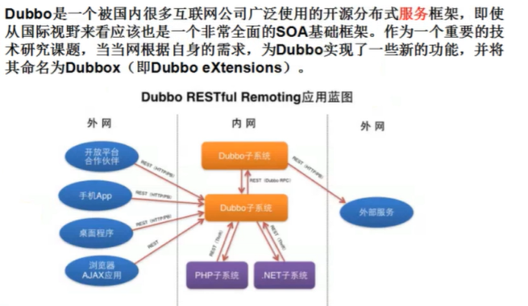
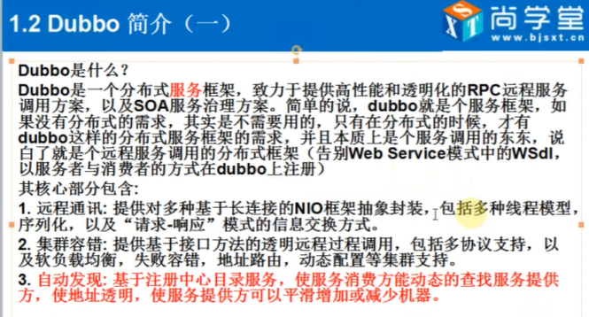
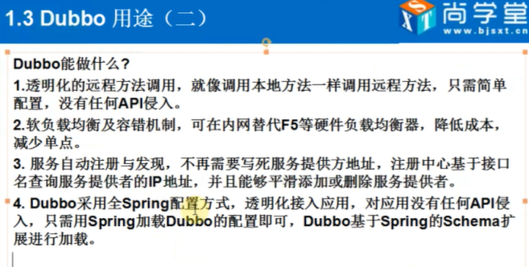

# dubbo介绍

> 以下资料来源自官网：dubbo.apache.org/zh-cn/docs/user/preface/architecture.html

#### dubbo 的架构

##### 节点角色说明
|节点 |角色说明
|---- |----
|Provider |暴露服务的服务提供方
|Consumer |调用远程服务的服务消费方
|Registry|服务注册与发现的注册中心|Monitor|统计服务的调用次数和调用时间的监控中心
|Container|服务运行容器

##### 调用关系说明
1. 服务容器负责启动，加载，运行服务提供者。
2. 服务提供者在启动时，向注册中心注册自己提供的服务。
3. 服务消费者在启动时，向注册中心订阅自己所需的服务。
4. 注册中心返回服务提供者地址列表给消费者，如果有变更，注册中心将基于长连接推送变更数据给消费者。
5. 服务消费者，从提供者地址列表中，基于软负载均衡算法，选一台提供者进行调用，如果调用失败，再选另一台调用。
服务消费者和提供者，在内存中累计调用次数和调用时间，定时每分钟发送一次统计数据到监控中心。

> Dubbo 架构具有以下几个特点，分别是连通性、健壮性、伸缩性、以及向未来架构的升级性。

http://dubbo.apache.org/zh-cn/docs/user/preface/architecture.html