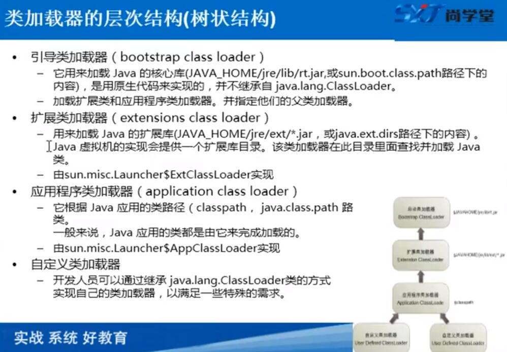
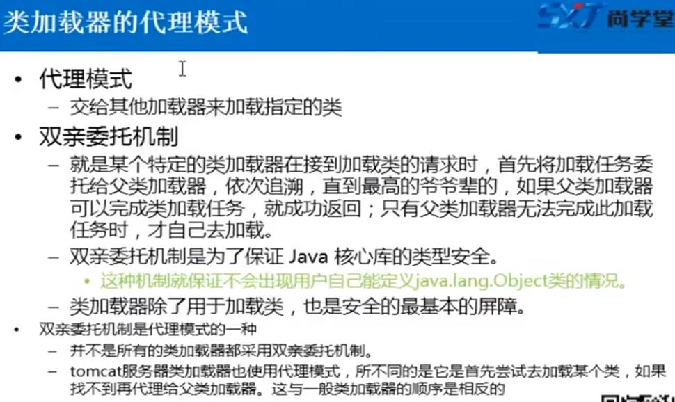
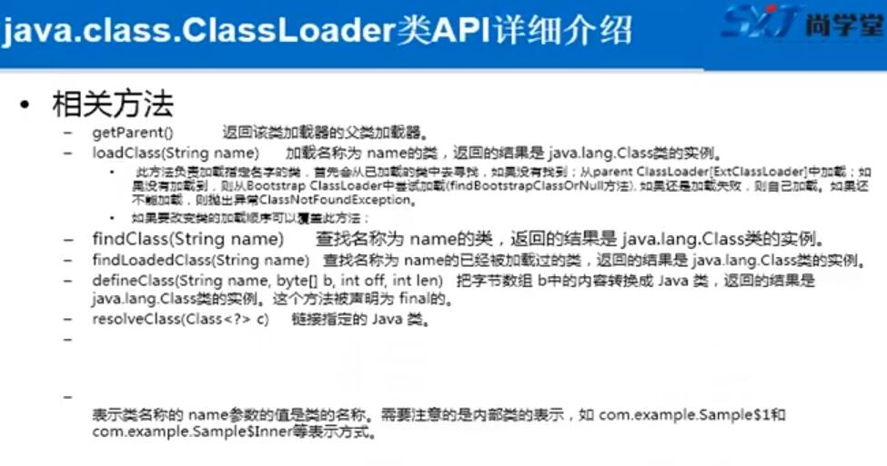
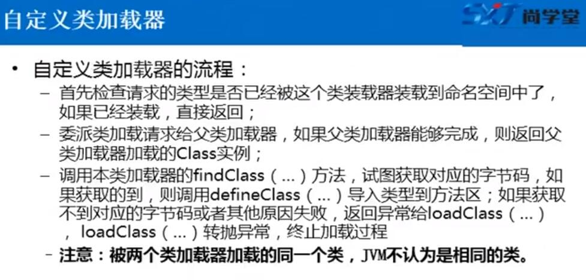

# classLoader

## 类加载器的层次结构


## 类加载的代理模式


## classLoader 相关方法


## 自定义类加载器


```自定义类加载器代码示例：```

    package classloader;

    import java.io.ByteArrayOutputStream;
    import java.io.FileInputStream;

    /**
    * 加载class文件到系统
    */
    public class FileSystemClassLoader extends ClassLoader {

        private String rootpath;

        public FileSystemClassLoader(String rootpath) {
            this.rootpath = rootpath;
        }

        @Override
        public Class<?> findClass(String name) throws ClassNotFoundException {
            // 先查询有没有加载过这个类
            Class<?> c = super.findLoadedClass(name);

            if (c != null) {
                return c;
            } else {
                // 委托给父加载器加载
                ClassLoader parent = super.getParent();
                try{
                    c = parent.loadClass(name);
                }catch (ClassNotFoundException e){

                }

                if (c != null) {
                    return c;
                } else {
                    // 父类加载器也加载不到，就从文件路径加载
                    byte[] classData = getClassData(name);

                    c = defineClass(name, classData, 0, classData.length);
                }
            }

            return c;
        }

        /**
        * 加载.class 文件
        *
        * @param className
        * @return
        */
        private byte[] getClassData(String className) {
            String path = rootpath + "/" + className.replace('.', '/') + ".class";
            try {
                ByteArrayOutputStream byteArrayOutputStream = new ByteArrayOutputStream();

                FileInputStream fileInputStream = new FileInputStream(path);

                byte[] buffer = new byte[1024];
                int len = 0;
                while ((len = fileInputStream.read(buffer)) != -1) {
                    byteArrayOutputStream.write(buffer, 0, len);
                }
                return byteArrayOutputStream.toByteArray();
            } catch (Exception e) {
                e.printStackTrace();
                return null;
            }
        }

    }


```自定义class loader测试```

    package classloader;

    import java.lang.reflect.Constructor;
    import java.lang.reflect.InvocationTargetException;
    import java.lang.reflect.Method;

    public class ClassLoaderTest {
        public static void main(String[] args) throws ClassNotFoundException, NoSuchMethodException, IllegalAccessException, InvocationTargetException, InstantiationException {
            FileSystemClassLoader fileSystemClassLoader = new FileSystemClassLoader("");
            FileSystemClassLoader fileSystemClassLoader2 = new FileSystemClassLoader("");


            Class<?> aClass = fileSystemClassLoader.findClass("java.lang.String");
            Class<?> aClass1 = fileSystemClassLoader2.findClass("java.lang.String");

            System.out.println(aClass.hashCode());
            System.out.println(aClass1.hashCode());

            FileSystemClassLoader fileSystemClassLoader3 = new FileSystemClassLoader("D:\\githubWorkSpace\\pkusoft\\target\\classes");
            FileSystemClassLoader fileSystemClassLoader4 = new FileSystemClassLoader("D:\\githubWorkSpace\\pkusoft\\target\\classes");
            Class<?> aClass3 = fileSystemClassLoader3.findClass("com.zzq.util.JsonResult");
            Class<?> aClass4 = fileSystemClassLoader3.findClass("com.zzq.util.JsonResult");
            Class<?> aClass5 = fileSystemClassLoader4.findClass("com.zzq.util.JsonResult");

            System.out.println(aClass3.hashCode());
            System.out.println(aClass4.hashCode());
            System.out.println(aClass5.hashCode());

        }

        public static void getFileClassAndExecutorMethod() throws ClassNotFoundException, NoSuchMethodException, IllegalAccessException, InvocationTargetException, InstantiationException {
            FileSystemClassLoader fileSystemClassLoader = new FileSystemClassLoader("D:\\githubWorkSpace\\pkusoft\\target\\classes");

            Class<?> aClass = fileSystemClassLoader.findClass("com.zzq.util.JsonResult");

            // 获取有参构造方法
            Constructor<?> constructor = aClass.getConstructor(boolean.class, String.class, Object.class);

            Object instance = constructor.newInstance(true, "获取成功!", "this is data...");

            // 反射调用方法
            Method getMsg = aClass.getMethod("getMsg");

            Object invoke = getMsg.invoke(instance);

            System.out.println("获取结果：" + invoke);
        }

    }
