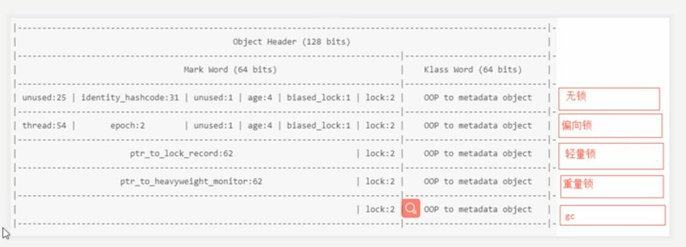

# synchronized 关键字

代码：

    package lock;

    public class L {
        private int i = 10;
    //    private boolean flag = true;
    //    private float f = 1.0f;
    //    private long l = 10l;
    }

    public class Test {

        private static L lock = new L();

        public static void main(String[] args) {
            lockTest();
        }

        public static void lockTest(){
            synchronized (lock){
                System.out.println("xxxx");
            }
        }

    }

问题：
    java 当中又哪些锁？
    锁什么，锁代码块？锁对象？

    锁住的是对象，lock 对象

    ReentrantLock 加锁的时候，是改变了ReentrantLock对象里面的一个属性，
    那么 synchronized 又是怎样上的锁？
    答案：synchronized 锁住的是对象的对象头

    那么什么是对象头呢？java对象由什么组成？对象在堆上到底要分配多大内存？

    至少需要考虑属性-----Java实例数据，java对象头

    1. java对象的实例数据--不固定
    2. 对象头--固定
    3. 数据对齐(jvm64位给对象分配的大小都是 8byte 的整数倍，如果对象大小没到8byte的倍数，那就有补位)

    lock.L object internals:
    OFFSET  SIZE   TYPE DESCRIPTION                               VALUE
        0     4        (object header)                           01 00 00 00 (00000001 00000000 00000000 00000000) (1)
        4     4        (object header)                           00 00 00 00 (00000000 00000000 00000000 00000000) (0)
        8     4        (object header)                           43 c1 00 20 (01000011 11000001 00000000 00100000) (536920387)
        12     4    int L.i                                       10
    Instance size: 16 bytes
    Space losses: 0 bytes internal + 0 bytes external = 0 bytes total

### 探索java对象的布局以及对象头的布局
1. JOL 来分析java的对象布局

pom.xml

        <dependency>
            <groupId>org.openjdk.jol</groupId>
            <artifactId>jol-core</artifactId>
            <version>0.9</version>
        </dependency>

示例：
    System.out.println(ClassLayout.parseInstance(lock).toPrintable());

java对象头由什么组成？object header

    java对象头大小：96bit

    1. Mark Word => 64bit(64位虚拟机下)
    2. (准确来说叫：klass pointer)Class Metadata Address => 32bit(也有可能是64，未开启指针压缩，64位下就是 64bit)

使用 synchronized 关键字的时候，对象的状态：(该状态存放再 Mark Word 里面)
--  多的一个第一位 0/1 是标识是否有偏向锁
1. 无状态，new出来的时候(001)
2. 偏向锁 (101)
3. 轻量 (00)
4. 重量锁 (10)
5. gc标记(比如说方法里面new出来的对象不存在了，栈帧没了对象也就没了，要被回收了) (11)

    对象头倒着读
    经过一次gc之后第一个的倒数3-7 变成了 0001 证明+了1岁

    lock.L object internals:
    OFFSET  SIZE                    TYPE DESCRIPTION                               VALUE
        0     4                         (object header)                           09 ad 34 36 (00001001 10101101 00110100 00110110) (909421833)
        4     4                         (object header)                           59 00 00 00 (01011001 00000000 00000000 00000000) (89)
        8     4                         (object header)                           43 c1 00 20 (01000011 11000001 00000000 00100000) (536920387)
        12     4                     int L.i                                       1000000000
        16     4   com.zzq.DfsController L.dfsController                           (object)
        20     4                         (loss due to the next object alignment)

hashcode 真的存在吗？

    不存在，hashcode 在调用对象的 hashcode() 方法之后，才会有。

    手动获取hashcode示例：

        public static long countHashCode(Object obj) throws NoSuchFieldException, IllegalAccessException {
            // 手动计算hashCode
            Field field = Unsafe.class.getDeclaredField("theUnsafe");

            field.setAccessible(true);

            Unsafe unsafe = (Unsafe) field.get(null);

            long hashCode = 0l;
            for (int i = 7; i > 0; i--) {
                // 取mark word 中的每一位进行计算
                hashCode |= (unsafe.getByte(obj, i) & 0xFF) << ((i - 1) * 8);
                System.out.println((Long.toHexString(unsafe.getByte(obj, i) & 0xFF)));
                System.out.println(Long.toHexString(hashCode));
            }

            return hashCode;
        }

