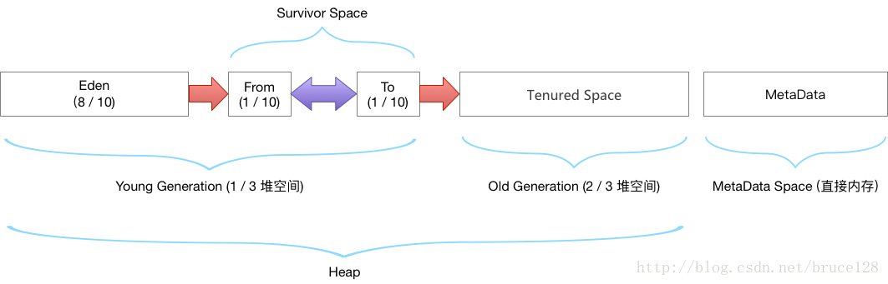

# java 内存分配

## java 堆空间默认分配
* 老年代 ： 三分之二的堆空间
* 年轻代 ： 三分之一的堆空间
    * eden区： 8/10 的年轻代空间
    * survivor0 : 1/10 的年轻代空间
    * survivor1 : 1/10 的年轻代空间

如图所示：

| 参数        | 作用    
| --------   | -----   
| -XX:InitialSurvivorRatio        | 新生代Eden/Survivor空间的初始比例
| -XX:Newratio | Old区 和 Yong区 的内存比例     

### jdk 1.7 运行时数据区分配
;

### jdk 1.8 运行时数据区分配

* 1.8 和1.7最大的区别就是元数据区取代了永久代。元空间的本质和永久代类似，都是对JVM规范中方法区的实现。不过元空间与永久代之间最大的区别在于：元数据空间并不在虚拟机中，而是使用本地内存。

jvm 调优，指的是对堆进行调优，避免full gc，减少 ygc 次数，避免stw

jvm 对象分配在堆上，方法中的对象在虚拟机 栈中的栈帧中，方法执行完了栈帧便消失，所以 栈不需要垃圾回收

jvm 调优工具，jconsole，jvisualvm
