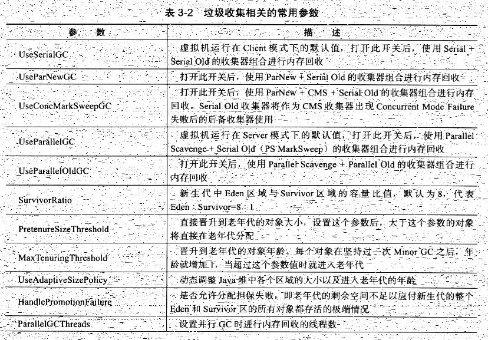
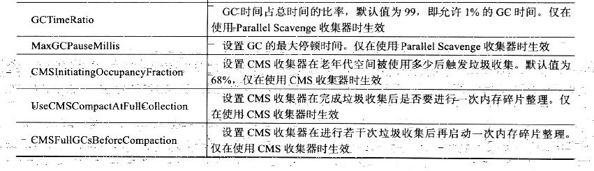
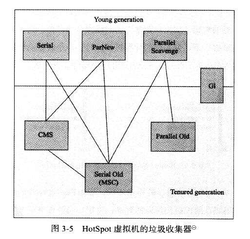

# jvm垃圾收集

### 垃圾收集参数



### 垃圾收集器的具体收集器

上下有连线的代表可以组合使用



* Serial 收集器
    > 最早的垃圾收集器，是一个单线程收集器，而且在垃圾收集的时候会停掉所有的其他线程。特点：简单高效，特别是在单cpu里面。

* ParNew  收集器
    > Serial 收集器的多线程版本，默认开启收集线程数与cpu相同

* Parallel Scavenge 收集器
    > 新生代收集器，并行的多线程收集器。特点是可控制吞吐量```(吞吐量=运行用户代码的时间/(运行用户代码的时间+垃圾收集的时间))```，

* Serial Old 收集器
    > Serial 收集器的老年代版本，单线程收集器

* Parallel Old 收集器
    > Parallel Scavenge 的老年代版本，与   Parallel Scavenge 结合使用达到  ```吞吐量优先 ```

* CMS 收集器
    > concurrent mark sweep 该收集器是一种获取最短回收停顿的垃圾收集器。该收集器回收步骤分为四部分
    1. 初始标记
    2. 并发标记(任然有STW)
    3. 重新标记(任然有STW)
    4. 并发清除

* G1 收集器
    > 目标是替换CMS收集器的一款强大的收集器

    