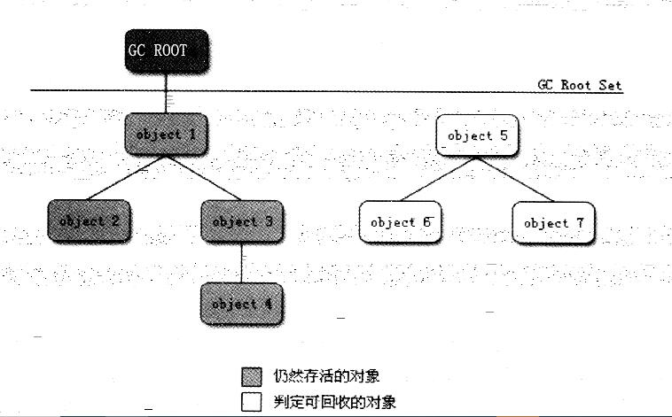

# 引用计数算法和可达性算法判断对象是否死亡

#### 引用计数算法

> 实现思路：给对象添加一个引用计数器，每当有一个地方引用，计数器就加1，当引用失效，就减1。 任何时刻，引用计数器值为0 就是不可能再被使用的对象。该算法虽然简单，判定效率也高，但是该算法很难解决对象循环引用的问题，所以```主流虚拟机不使用该算法```

#### 可达性算法

> 实现思路：该算法通过一系列称为``gc root``的对象作为起点，从这些节点向下搜素，搜索所走过的路称为引用链，当一个对象到 ```GC ROOT``` 没有任何引用链相连，则证明该对象就是不可用的。

如图所示：


> 在java语言中，可以作为 GC ROOT 的有
* 虚拟机栈(栈帧中的本地变量表)中引用的对象
* 方法区中类静态属性引用的对象
* 方法区中常量引用的对象
* 本地方法栈中JNI(native方法)引用的对象