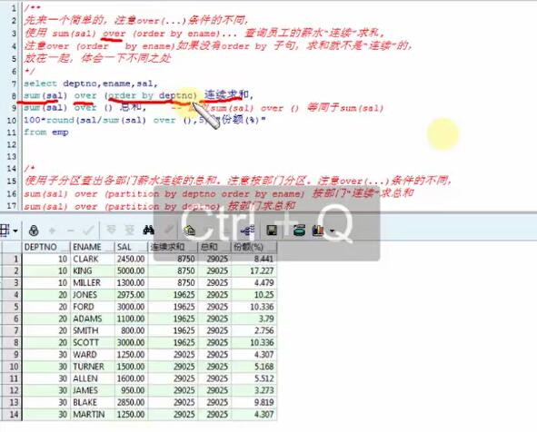
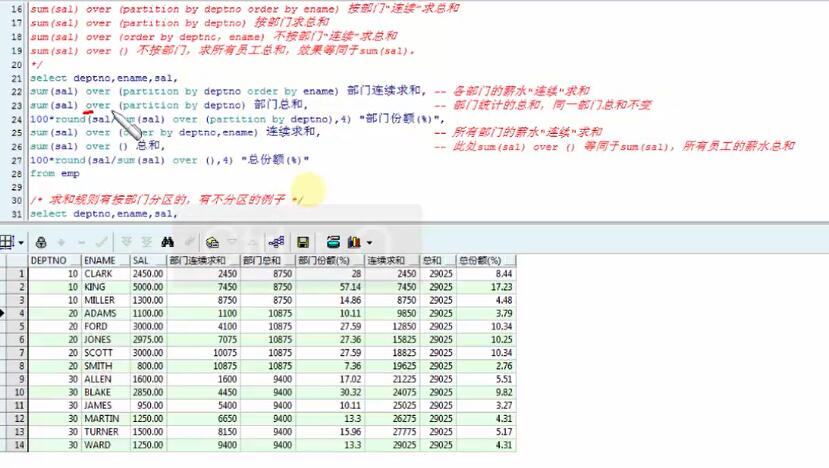
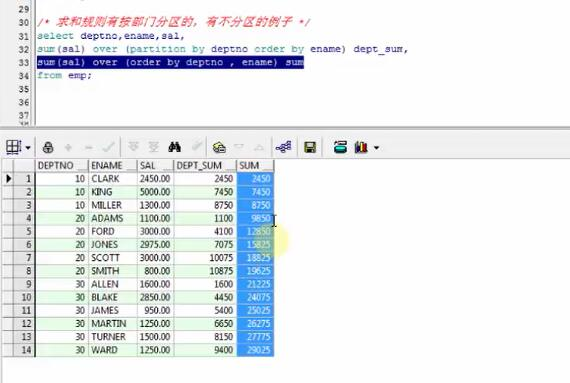
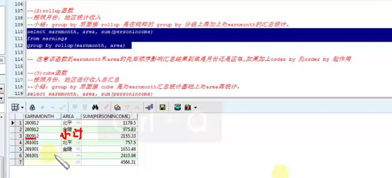
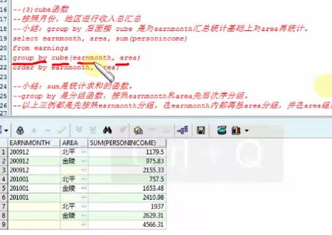
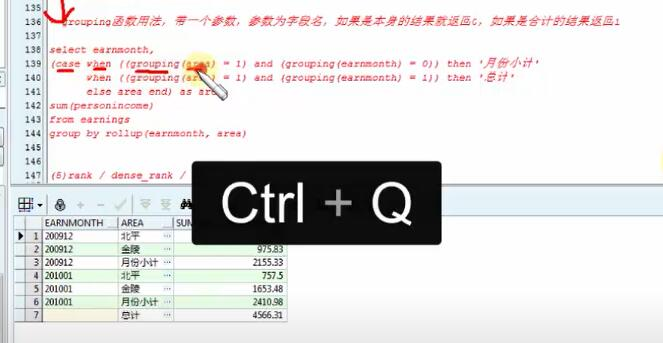
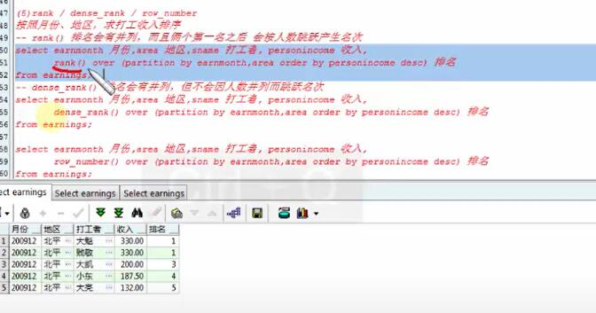

# oracle-分析函数

* over函数
* over partition by 组合
* over partition by order by 组合
* row_number 函数
* rollup
* cube
* grouping

### over 函数

> 例子




### over partition(分区) by 组合 

> 例子



### over partition(分区) by order by 组合 

> 例子, 先分区，然后按照 ```Ename``` 求总和



### rollup 分组函数(类似 group by，但是有小计，总和功能)

> 例子




### cube 统计分析函数，功能更强大

> 例子




### grouping 带一个参数，参数为字段名，如果是本身的结果就返回 0 ，合计结果就返回1

> 例子




### rank , dense_rank , row_number

> 例子



