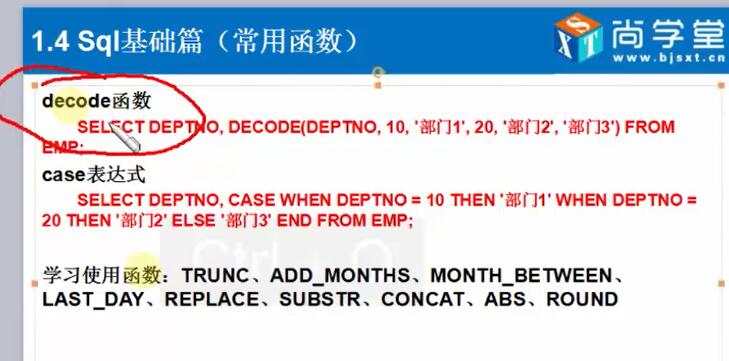

# sql基础

### sql操作基础

##### 只要是DML(除了select)操作，oracle 都会产生undo(日志)，只要是DMM操作，就会产生lock(锁)

##### DCL 里面的 grant(授权)，revoke(收回授权)

> 例如(grant)

    Grant  <权限>  on  表名[(列名)]  to  用户 With  grant  option

    或 GRANT <权限> ON <数据对象> FROM <数据库用户>  

    //数据对象可以是表名或列名

    //权限表示对表的操作，如select,update,insert,delete
     
    注：授权命令是由数据库管理员使用的，若给用户分配权限时带With  grant  option子句，
    

    grant  select on student to user1 with grant option

> 例如(revoke)

    回收权限 revoke
    REVOKE <权限> ON <数据对象>  FROM <数据库用户名>

    revoke翻译:
    vt.撤销，取消；废除 vi.有牌不跟 n.有牌不跟

    当我们想除去用户user1的查询操作时，执行以下命令即可

    //回收用户user1对表student的查询权限
    revoke select on student from user1
    //或 revoke select on student from user1 cascade

`` 原文链接：https://blog.csdn.net/hfdgjhv/article/details/83834076  ``

### oracle 数据类型

### oracle 时间格式化

### oracle decode 函数(oracle专有，类似 case when)

### oracle 连接查询，集合

### oracle 子查询

### oracle rownum

### oracle copye table

### oracle 递归函数

### oracle merge

