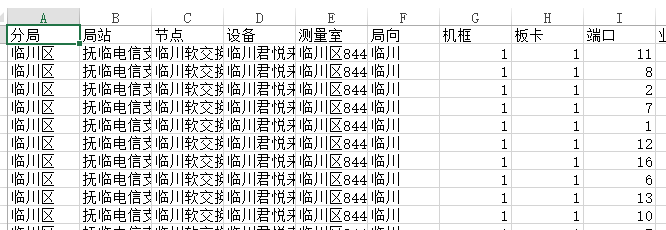
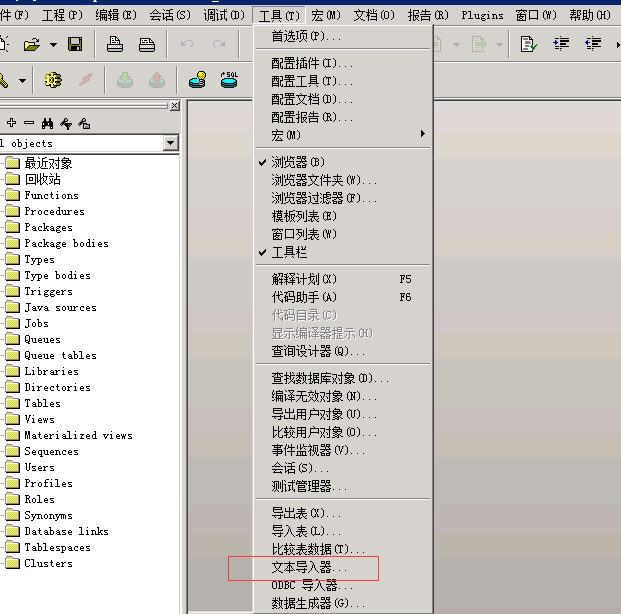
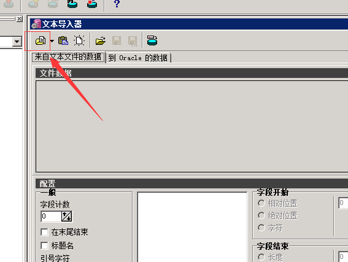
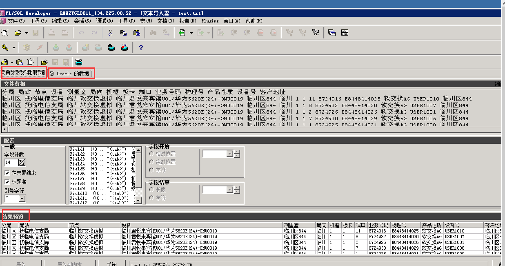
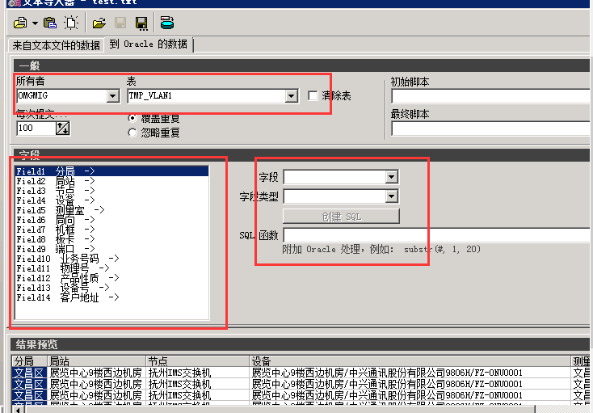

# 使用plsql将excel数据导入表中

> 通过使用PL/SQL 批量查询取数时，将excel中的每一列数据复制黏贴进新建的中间表，黏贴时会有贴歪的情况，也就是某些列会从第二第三行开始插入整列，导致数据乱掉，然后好像又不支持批量删除整列数据，所以一次性导入整张excel表是最佳方法啦。

* 第一步
将excel中要插入oracle的数据全部选中：(必须选中，不然导不进数据库)

* 第二步
然后另存为：文本文件(制表符分隔)(*.txt)

* 第三步
然后进入PL/SQL 选择工具-》文本导入器

* 第四步
进行文件的选择：

* 第五步
选择文件后就会出现下面这个界面，可以看到结果预览

* 第六步
点击“到oracle的数据“，选择表所有者和表名，就可以看到excel中的表头的名称，对应可以选择对应字段了

* 第七步

点击导入，就行了。

