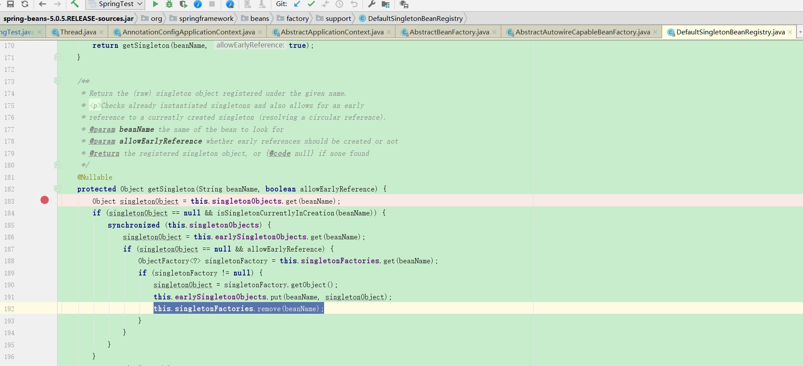

# spring bean 的产生过程

1.  spring 扫描所有需要注入到spring、容器里面的类
2.  parse 解析对象
3.  调用扩展(如果有，比如说扩展 BeanFactoryPostProcessor 类)
4.  遍历map,验证，看是否为原型
5.  new 实例化类

### spring 默认小驼峰命令bean

### spring 默认命名->注解有value时直接使用注解里面的值做beanName

### 禁止spring循环依赖

    @Test
    public void shoutdownCircular(){
        AnnotationConfigApplicationContext context = new AnnotationConfigApplicationContext();

        context.register(Application.class);

        // 在此处进行处理
        AbstractAutowireCapableBeanFactory beanFactory = (AbstractAutowireCapableBeanFactory) context.getBeanFactory();
        // 禁止进行循环依赖
        beanFactory.setAllowCircularReferences(false);

        context.refresh();

    }

### spring 装配bean(给bean装配autowird 之类的)

装配bean之后就是初始化bean，执行bean的回调方法，比如说 @PostConstruct 方法，实现 InitializingBean  的方法调用，xml配置的方法调用。调用顺序在下面，代码为证

spring aop 也是在最后一步(xml配置调用那里)完成的

### Autowired 和 Resource 的区别

@Resource 是java自带注解，spring支持，使用 CommonAnnotationBeanPostProcessor 扫描，可以byName和byType注入

@Autowired 是spring注解，使用 AutowiredAnnotationBeanPostProcessor 扫描，可以和 @Qualifier 注解一起通过beanName注入

### spring bean 加载过程(个人理解)
spring bean 加载过程，从java字节码开始，扫描需要注入到spring 容器里面的对象，然后生成 BeanDefinition 对象，之后进行检查，比如说是否为单例，是否依赖别的类，然后从单例池里面获取该对象，如果获取不到，再从三级缓存里面获取，还是获取不到就从单例工厂里面获取，然后进行bean初始化，然后初始化bean，然后调用 populate 方法填充bean，解决循环依赖问题，然后使用不同的扫描器扫描加载装配bean，比如说 @Resource 的使用 CommonAnnotationBeanPostProcessor 扫描加载，

@Autowired 注解的使用 AutowiredAnnotationBeanPostProcessor 扫描加载，此时会调用bean的默认构造方法，spring 实例化bean 本质上也还是使用的反射。然后进行spring的方法回调(比如说 InitBinder方法，@PostConstruct 方法)

### 获取spring 后置处理器(比如说处理循环依赖)

### 循环依赖比如说 IndexService 里面依赖 UserService , UserService 里面依赖 IndexService

比如说先实例化 IndexService 的时候，spring 会先把 IndexService new 出来，然后执行构造方法，然后走bean 的生命周期，走到 populateBean 方法对bean进行填充，填充 IdnexService 的属性，发现 IndexSerivce 里面的 UserService 需要填充，于是去get USerSerivce ， 如果发现UserService 并不存在于容器当中，(因为这个时候还没有实例化 UserService)，所以开始实例化 UserService ，同样也是先new出来，然后调用构造方法，接着往下执行生命周期，执行到 populateBean 填充bean 时候，发现 UserService 依赖 IndexService ，然后就从容器中获取这个 IndexService ，然后发现容器里面并没有 IndexService (因为 IndexService 还没到spring 容器中来)，于是又来实例化 IndexService ，先从单例池中拿，单例池中拿不到就到缓存中来拿，于是这个时候就可以把 IndexService 从第三个缓存中拿出来，于是就把IndexService 拿到，拿到IndexService 的半成品填充到 UserService 的 IndexService 属性中去，于是往上返回，返回到最开始的 IndexService ，再填充 UserService，这个就是循环依赖大体的思路。

-- singletonObjects 单例池，第一个map
-- singletonFactories 单例工厂，第二个map
-- earlySingletonObjects 三级缓存

### spring 三个map讲解

如图所示三级缓存put了一个从二级缓存中get的对象，并把二级缓存中的对象给删掉了，为什么？因为工厂代码非常复杂，防止重复创建，多次循环引用的时候不需要多次创建，多次循环引用的时候，不需要重读创建。直接从三级缓存里面拿

从图中的代码也可以看到，获取单例对象是先从 单例池里面获取，没有的话从三级缓存里面获取，再没有就从 单例工厂里面获取。