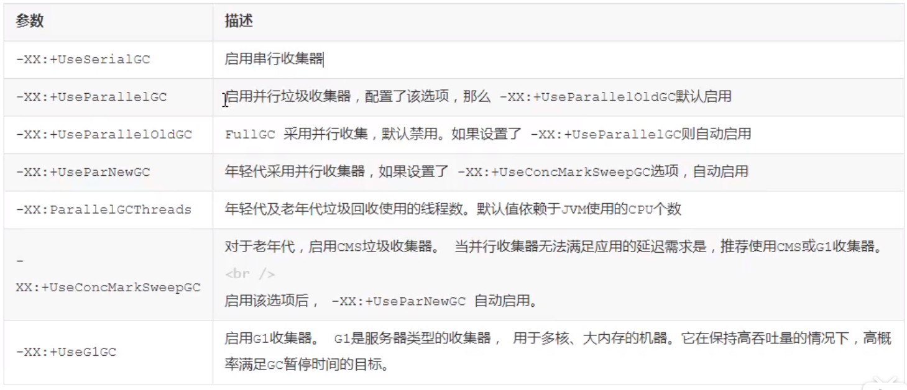

# tomcat 性能调优

## 1.1 JVM 调优

​	tomcat 是一款java应用，既然是Java应用，那么就和jvm的配置密切相关。

​	jvm的调优侧重在内存分配 和 gc策略的调整上，因为内存会直接影响服务的运行效率和吞吐量，JVM垃圾回收则会不同程度的导致程序运行中断(fgc stw)。可以根据应用程序的特点，选择不同的垃圾回收策略，调整jvm垃圾回收策略，可以极大减少垃圾回收次数，提升垃圾回收效率，改善程序运行性能。

### 1.1.1  jvm 参数优化


例如：

```shell
JAVA_OPTS='-server -Xms2048M -Xmx2048M -XX:MetaspaceSize=256M';(LINUX)


set JAVA_OPTS=-server -Xms1024M -Xmx1024M -XX:MetaspaceSize=256M -XX:MaxMetaspaceSize=512M(WINDOWS)
```

然后可以使用 jdk自带的 jmap 查看内存分配

linux 可以 ps 找到进程号，然后 jmap -heap 进程号

```shell
Attaching to process ID 2083, please wait...
Debugger attached successfully.
Server compiler detected.
JVM version is 25.121-b13

using thread-local object allocation.
Mark Sweep Compact GC

Heap Configuration:
   MinHeapFreeRatio         = 40
   MaxHeapFreeRatio         = 70
   MaxHeapSize              = 536870912 (512.0MB)
   NewSize                  = 178913280 (170.625MB)
   MaxNewSize               = 178913280 (170.625MB)
   OldSize                  = 357957632 (341.375MB)
   NewRatio                 = 2
   SurvivorRatio            = 8
   MetaspaceSize            = 268435456 (256.0MB)
   CompressedClassSpaceSize = 1073741824 (1024.0MB)
   MaxMetaspaceSize         = 17592186044415 MB
   G1HeapRegionSize         = 0 (0.0MB)

Heap Usage:
New Generation (Eden + 1 Survivor Space):
   capacity = 161021952 (153.5625MB)
   used     = 118644696 (113.14839935302734MB)
   free     = 42377256 (40.414100646972656MB)
   73.68231134100274% used
Eden Space:
   capacity = 143130624 (136.5MB)
   used     = 110897144 (105.75975799560547MB)
   free     = 32233480 (30.74024200439453MB)
   77.47967618725676% used
From Space:
   capacity = 17891328 (17.0625MB)
   used     = 7747552 (7.388641357421875MB)
   free     = 10143776 (9.673858642578125MB)
   43.30339257097069% used
To Space:
   capacity = 17891328 (17.0625MB)
   used     = 0 (0.0MB)
   free     = 17891328 (17.0625MB)
   0.0% used
tenured generation:
   capacity = 357957632 (341.375MB)
   used     = 22253376 (21.22247314453125MB)
   free     = 335704256 (320.15252685546875MB)
   6.216762546915049% used

25311 interned Strings occupying 3175632 bytes.
```
此处我设置 堆固定 512Mb，可以看到 堆内存确实就是 512Mb 固定。还可以查看 新生代，老年代大小。

### 1.1.2 GC策略

JVM 垃圾回收性能有以下两个主要的指标

1. 吞吐量：工作时间(排除GC时间)占总时间的百分比，工作时间包含程序运行时间+内存分配时间
2. 暂停时间：由垃圾回收导致的应用程序停止响应时间(次数)(FGC STW)

垃圾回收器简介：


[垃圾收集器介绍，配合使用](../jvm/jvm垃圾收集.md)

不同的应用程序，对于垃圾回收会有不同的需求。JVM 会根据运行的平台、服务器资源配置情况选择合适的垃圾收集器、堆内存大小及运行时编译器。如无法满足需求，参考以下准则:

A.程序数据量较小,选择串行收集器。

B.应用运行在单核处理器上且没有暂停时间要求，可交由JVM自行选择或选择串行收集器。

C.如果考虑应用程序的峰值性能，没有暂停时间要求，可以选择并行收集器。

D.如果应用程序的响应时间比整体吞吐量更重要，可以选择并发收集器。


### 1.1.3 查看tomcat使用的垃圾收集器

可以使用 jconsole 进行查看，vm概要。

tomcat配置远程jconsole连接=>[link](../jvm/jconsole配置远程连接.md)

### 1.1.4 配置垃圾收集器

gc参数：



我们也可以在测试的时候，将jvm参数调整之后，将gc日志打印出来，便于为我们进行参数调整提供依据，具体参数如下：


set JAVA_OPTS=-server -Xms2048M -Xmx2048M -XX:MetaspaceSize=256M -XX:MaxMetaspaceSize=512M -XX:+UseG1GC -XX:+PrintGC -XX:+PrintGCDetails


## 1.2 tomcat配置调优

调整 tomcat/conf/server.xml 中关于链接器(Connector)的配置可以提高服务器的性能。

