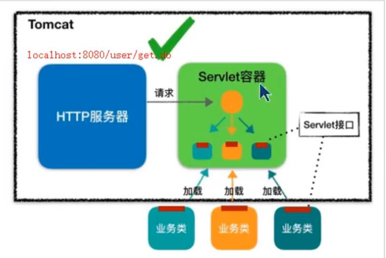
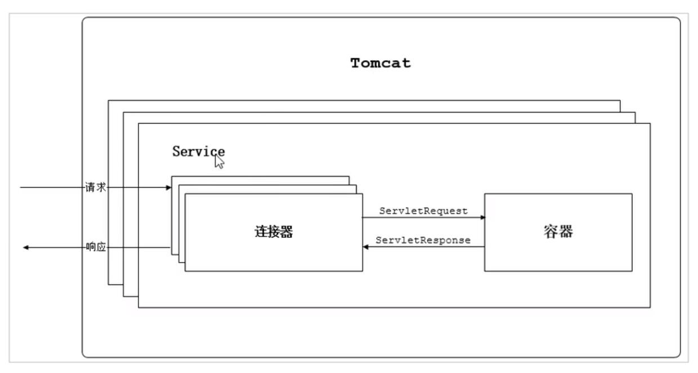

# 1.1 tomcat 架构

HTTP 服务器并不直接调用 servlet，而是将请求交给 Servlet容器来处理，实现解耦。servlet 容器和 servlet接口得出现，就是为了HTTP服务器与业务类解耦。

# 1.2 servlet容器加载流程

为了解耦，http服务器不直接调用servlet类，而是将请求交给servlet容器来处理。

当客户请求某个资源时, HTTP服务器会用一-个servletRequest对象把客户的请求信息封装起来,然后调用servlet容器的service方法，servlet容器拿到请求后,根据请求的URI和servlet的映射关系,找到相应的servlet ,如果servlet还没有被加载,就用反射机制创建这个servlet ,并调用servlet的init方法来完成初始化,接着调用servlet的service方法来处理请求,把servletResponse对象返回给HTTP服务器, HTTP服务器会把响应发送给客户端。

# 1.3 tomcat整体架构

设计一个系统，首先是了解需求。

tomcat两个核心需求，需要实现以下两个功能

1. 处理socket连接，负责网络字节流与Request 和 Response 对象的转化
2. 加载和管理servlet，以及具体处理Request请求

因此Tomcat 设计了两个核心的组件，连接器(Connector)和容器(Container)分别来做这两件事，连接器负责对外交流，容器负责内部处理。

