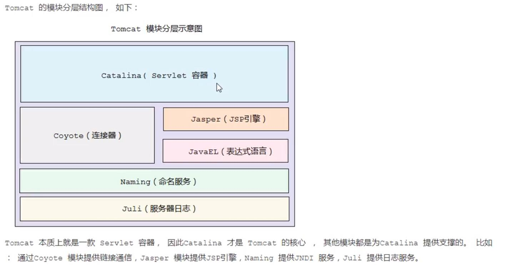
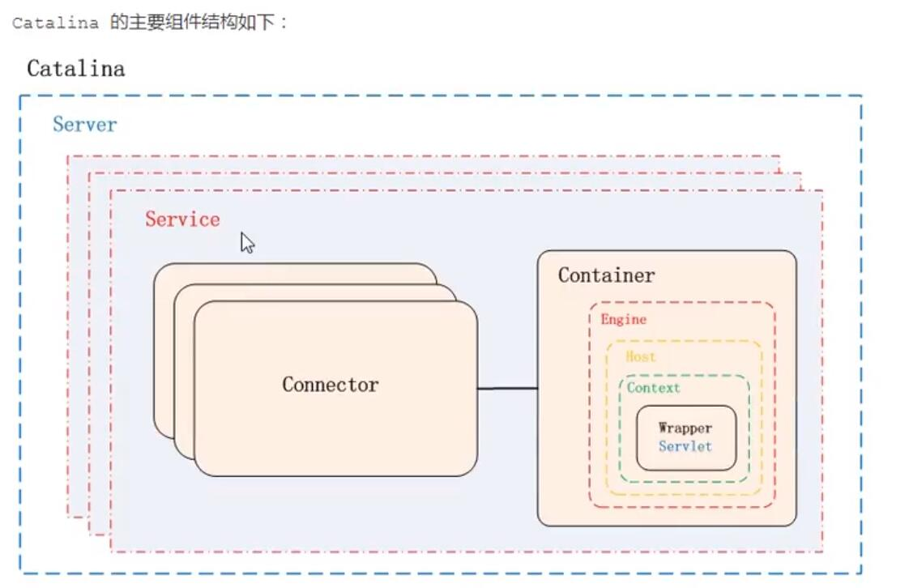

# Catalina 容器

Tomcat 是一个由一系列可配置的组件构成的Web容器，而Catalina是Tomcat的servlet容器。

Catalina是servlet容器的实现，包含了安全，会话，集群，管理。与coyote松耦合

## Catalina 模块

## Catalina 容器结构

如上图所示，Catalina负责管理Server，而Server表示着整个服务器。Server下面由多个Service，每个服务包含着多个连接器组件Connector(Coyote 实现)和一个容器组件Contain。在Tomcat启动的时候，会初始化一个Catalina的实例。

Catalina 各个组件的职责：

| 组件      | 职责                                                         |
| --------- | :----------------------------------------------------------- |
| Catalina  | 负责解析Tomcat的配置文件，以此来创建服务器server组件,并根据命令来对其进行管理 |
| Server    | 服务器表示整个Catalina Servlet容器以及其它组件,负责组装并启动servlet引擎，Tomcat连接器。Server通过实现Lifecycle接口,提供了一种优雅的启动和关闭整个系统的方式 |
| Service   | 服务是Server内部的组件,一个server包含多个service。它将若干个connector组件绑定到一个Container ( Engine )上 |
| Connector | 连接器,处理与客户端的通信，它负责接收客户请求,然后转给相关的容器处理，最后向客户返回响应结果 |
| Container | 容器，负责处理用户的servlet请求,并返回对象给web用户的模块    |

## Container 结构

Tomcat 设计了4种容器，分别是 Engine，Host，Context，Wrapper。这四种容器不是平行关系，而是父子关系。Tomcat通过一种分层的架构，使得Servlet容器具有很好的灵活性。

| 容器    | 描述                                                         |
| ------- | ------------------------------------------------------------ |
| Engine  | 表示整个Catalina的servlet引擎,用来管理多个虚拟站点,一个Service最多只能有一个Engine ,但是一个引擎可包含多个Host |
| Host    | 代表一个虚拟主机，或者说一一个站点，可以给Tomcat配置多个虚拟主机地址,而一一个虚拟主机下可包含多个Context |
| Context | 表示一个web应用程序，一个web应用可包含多个wrapper            |
| Wrapper | 表示一个Servlet , wrapper作为容器中的最底层,不能包含子容器   |

Tomcat是怎么管理这些容器的呢?你会发现这些容器具有父子关系,形成-一个树形结构,你可能马上就想到了设计模式中的组合模式。没错，Tomcat就是用组合模式来管理这些容器的。具体实现方法是,所有容器组件都实现了Container接口,因此组合模式可以使得用户对单容器对象和组合容器对象的使用具有一致性。 这里单容器对象指的是最底层的wrapper ,组合容器对象指的是上面的context、Host或者Engine。

