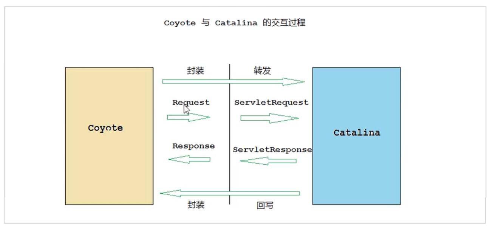
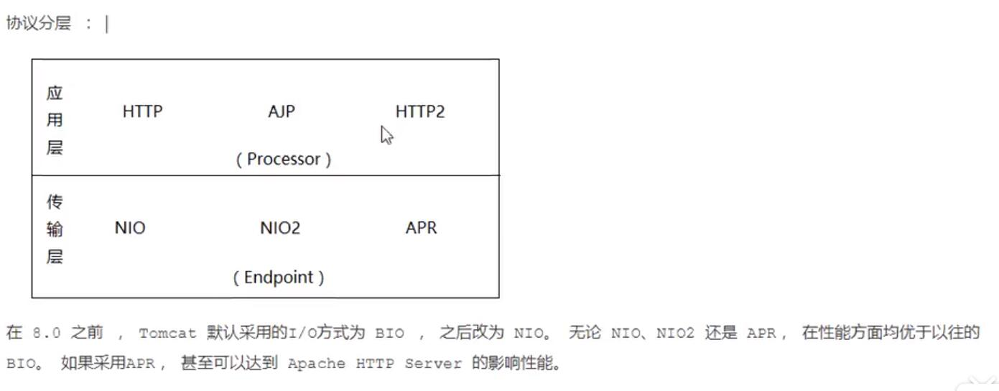
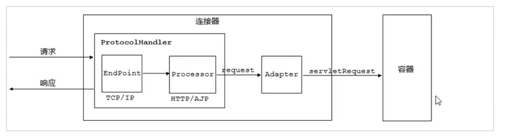

# coyote 连接器

## 1.1 coyote结构

​	Coyote是Tomcat的连接器框架的名称，服务器提供的供客户端访问的外部接口•客户端通过Coyote与服务器建立连接、发 送请求并接受晌应。	
​	Coyote封装了底层的网络通佶（Socket请求及响应处理）Catalina容器提供了统一的接口，使Catalina容器与具体的请求协 议及操作方式完全解耦。Coyote将Socket输入转换封装为Request对象，交由Catalina容器逬行处理，处理谓求完成后， Catalina通过Coyote提供的Response对象将结果写入输出流。
​	Coyote作为独立的模块，只负责具体协议和IO的相关操作，‘Servlet规范实现没有直接关系，因此即便是Request和 Response对象也并未实现Servlet规范对应的接口，而是在Catalina中持他们逬一步封装为ServletRequest和 ServletResponse 。

## 1.2 IO模型与协议

在 coyote 中，tomcat支持多种IO模型，和应用层协议。

Tomcat 支持的IO模型(自tomcat8.5之后就移除了BIO的支持)

| IO模型 | 描述                                                         |
| :----- | ------------------------------------------------------------ |
| NIO    | 非阻塞IO，采用java NIO实现                                   |
| NIO2   | 异步IO，采用JDK 7 最新的NIO2实现                             |
| APR    | 采用Apache可移植运行库实现，是 C/C++遍写的本地库，如果选择该方案，需要单独安装APR库 |

Tomcat 支持的应用层协议

| 应用层协议 | 描述                                                  |
| ---------- | ----------------------------------------------------- |
| HTTP/1.1   | 这是大部分web应用采取的协议                           |
| AJP        | 用于和Apache 服务器集成，实现静态文件的优化和集群部署 |
| HTTP/2     | 下一代http协议，8.5/9.x 之后支持                      |

​	Tomcat为了实现支持多种I/O模型和应用层协议，一个容器可能对接多个接器，就好比一个房间有多个门。但是单独的连接器或者容器都不能对外提供服务，需要把它们组装起来才能工作，组装后这个整体叫作service组件。这里请你注意，Service本身没有做什么重要的事情，只是在连接器和容器外面多包了一层，把它们组装在一起。Tomcat内可能有多个service，这样的设计也是出于灵活性的考虑。通过在Tomcat中配置多个service，可以实现通过不同的端口号来访问同一台机器上部需的不同应用。

## 1.3 连接器组件

连接器中的各个组件的作用如下:

EndPoint

​	1 ) EndPoint : Coyote 通信端点,即通信监听的接口,是具体socket接收和发送处理器,是对传输层的抽象,因此EndPoint用来实现TCP/ IP协议的。

​	2) Tomcat 并没有EndPoint 接口,而是提供了一一个抽象类AbstractEndpoint，里面定义了 两个内部类: Acceptor和SocketProcessor。Acceptor用于监听socket连接请求。SocketProcessor用于处理接收到的socket请求 ,它实现Runnable接口,在Run方法里调用协议处理组件Processor进行处理。为了提高处理能力, socketProcessor被提交到线程池来执行。而这个线程池叫作执行器( Executor) , 我在后面的专栏会详细介绍Tomca t如何扩展原生的Java线程池。

Processor

Processor : Coyote 协议处理接口, 如果说EndPoint是用来实现TCP/ IP协议的,那么Processor用来实现HTtp协议，

Processor接收来自EndPoint的socket ,读取字节流解析成Tomcat Request和Response对象 ,并通过Adapter将其提交到容器处理，Processor是对应用层协议的抽象。

ProtocolHandler

ProtocolHandler : Coyote 协议接口，通过Endpoint 和Processor,实现针对具体协议的处理能力。 Tomcat按照协议和I/O提供了6个实现类: AjpNioProtocol ， AjpAprProtocol ，AjpNio2Protocol ，Http11NioProtocol ，Http11Nio2Protocol , Http11AprProtocol。我们在配置tomcat/conf/server.xml 时，至少要指定具体的ProtocolHandler，当然也可以指定协议名称，如: HTTP/1.1 , 如果安装了APR ,那么将使用Http11AprProtocol，否则使用Http11NioProtocol 。

Adapter

由于协议不同,客户端发过来的请求信息也不尽相同, Tomcat定义了自己的Request类来“存放”这些请求信息。ProtocolHandler接口负责解析请求并生成Tomcat Request类。 但是这个Request对象不是标准的servletRequest ,也就意味着,不能用Tomcat Request作为参数来调用容器。Tomcat设计者的解决方案是引入CoyoteAdapter ,这是适配器模式的经典运用,连接器调用coyoteAdapter的Sevice方法,传入的是Tomcat Request对象 , CoyoteAdapter负责将Tomcat Request转成servletRequest ,再调用容器的Service方法。