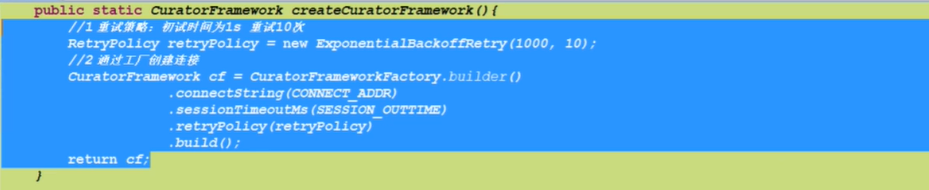
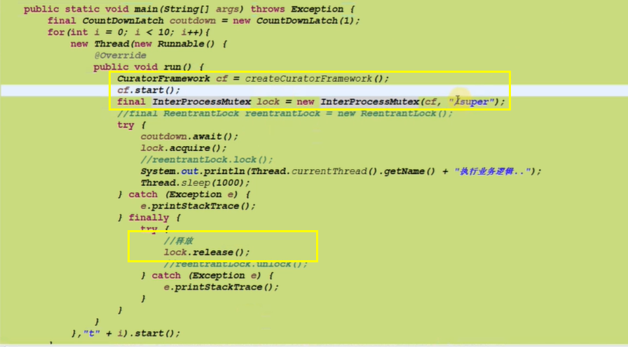

# curator实现分布式锁

> maven包管理

        <!-- https://mvnrepository.com/artifact/org.apache.zookeeper/zookeeper -->
        <dependency>
            <groupId>org.apache.zookeeper</groupId>
            <artifactId>zookeeper</artifactId>
            <version>3.5.6</version>
        </dependency>

        <!-- https://mvnrepository.com/artifact/org.apache.curator/curator-framework -->
        <dependency>
            <groupId>org.apache.curator</groupId>
            <artifactId>curator-framework</artifactId>
            <version>4.2.0</version>
        </dependency>
        <!-- https://mvnrepository.com/artifact/org.apache.curator/curator-recipes -->
        <dependency>
            <groupId>org.apache.curator</groupId>
            <artifactId>curator-recipes</artifactId>
            <version>4.2.0</version>
        </dependency>

> 代码实例

    package com.zzq.zk;

    import org.apache.curator.RetryPolicy;
    import org.apache.curator.framework.CuratorFramework;
    import org.apache.curator.framework.CuratorFrameworkFactory;
    import org.apache.curator.framework.recipes.locks.InterProcessMutex;
    import org.apache.curator.retry.ExponentialBackoffRetry;

    import java.util.Random;
    import java.util.concurrent.ExecutorService;
    import java.util.concurrent.Executors;

    public class ZkCurator02 implements Runnable {
        public static void main(String[] args) {
            ExecutorService service = Executors.newCachedThreadPool();
            ZkCurator02 curator02 = new ZkCurator02();
            for (int i = 0; i < 100; i++) {
                service.submit(curator02);
            }

            try {
                Thread.sleep(Integer.MAX_VALUE);
            } catch (InterruptedException e) {
                e.printStackTrace();
            }
        }

        private int count = 100;

        @Override
        public void run() {
            // 1.重试策略，初始1s，重试五次
            RetryPolicy policy = new ExponentialBackoffRetry(1000, 5);
            // 2.通过工厂方法获取链接对象
            CuratorFramework client = CuratorFrameworkFactory.builder()
                    .connectString("192.168.43.16:2181,192.168.43.161:2181,192.168.43.48:2181")
                    .retryPolicy(policy)
                    .connectionTimeoutMs(1000 * 1000)
                    .build();
            // 3.创建链接
            client.start();
            // 4.创建锁
            InterProcessMutex mutexLock = new InterProcessMutex(client, "/curator");
            try {
                mutexLock.acquire();
                int t = new Random().nextInt(3000);
                Thread.sleep(t);
                System.out.println(Thread.currentThread().getName() + "获得锁，开始休眠 " + t + " ms ");
                count--;
                System.out.println("计算出数据==>" + count);
            } catch (Exception e) {
                System.out.println("报错了==>" + e.getMessage());
            } finally {
                try {
                    System.out.println(Thread.currentThread().getName() + "释放锁");
                    mutexLock.release();
                } catch (Exception e) {
                    e.printStackTrace();
                }
            }

        }
    }
