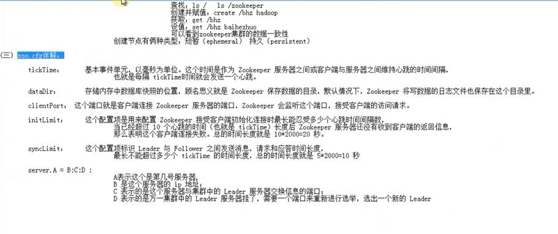

# zk安装

#### 第一步，下载安装文件

    wget https://www-us.apache.org/dist/zookeeper/zookeeper-3.5.6/apache-zookeeper-3.5.6-bin.tar.gz

#### 第二步，解压，tar -zxvf     apache-zookeeper-3.5.6-bin.tar.gz

#### 第三步，进入 conf 目录，复制 zoo_sample.cfg 改名为 zoo.cfg

#### 第四步，直接运行 bin/zkServer.sh start 就可以启动了

### zoo.cfg 配置解释

### 集群安装：
    https://blog.csdn.net/liyiming2017/article/details/83501836

### java 代码示例：

    import org.apache.zookeeper.*;
    import org.apache.zookeeper.data.Stat;
    import org.slf4j.Logger;
    import org.slf4j.LoggerFactory;

    import java.io.IOException;
    import java.util.concurrent.CountDownLatch;

    /**
    * @author maxwell
    */
    public class MyZkClient {

        private static Logger logger = LoggerFactory.getLogger(MyZkClient.class);

        public static void main(String[] args) throws IOException, InterruptedException, KeeperException {
            CountDownLatch latch = new CountDownLatch(1);

            ZooKeeper zooKeeper = new ZooKeeper("103.118.41.204:2181", 10000, new Watcher() {
                @Override
                public void process(WatchedEvent watchedEvent) {

                    if( watchedEvent.getState() == Event.KeeperState.Closed ){
                        logger.error("链接关闭");
                    }
                    if( watchedEvent.getState() == Event.KeeperState.SyncConnected ){
                        logger.error("SyncConnected");
                        logger.info("链接成功!!!!!!");
                        latch.countDown();
                    }
                    if( watchedEvent.getState() == Event.KeeperState.Expired ){
                        logger.error("链接过期");
                    }
                    if( watchedEvent.getState() == Event.KeeperState.ConnectedReadOnly ){
                        logger.error("ConnectedReadOnly");
                    }

                }
            });

            latch.await();

            logger.info("开始操作zk...");

            Stat stat = zooKeeper.exists("/licm", new MyWather());
            String s;
            if(stat==null){
                s = zooKeeper.create("/licm", "你是ZOOKEEPER吗？".getBytes(), ZooDefs.Ids.OPEN_ACL_UNSAFE, CreateMode.PERSISTENT);
                logger.info("创建成功！==》" + s);
            }else{
                s = new String(zooKeeper.getData("/licm", new MyWather(), stat));
                logger.info("读取数据成功！==》" + s);
            }

            zooKeeper.close();

        }

    }

    class MyWather implements Watcher{

        private static Logger logger = LoggerFactory.getLogger(MyWather.class);

        @Override
        public void process(WatchedEvent watchedEvent) {
            logger.info("myWather 开始监控...");
        }
    }
