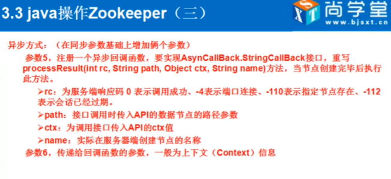

# java操作zookeeper

> 异步方式代码示例

        zooKeeper.create(basePath + "/sindex",
                "s".getBytes(), ZooDefs.Ids.OPEN_ACL_UNSAFE, CreateMode.PERSISTENT,
                new AsyncCallback.StringCallback() {
                    @Override
                    public void processResult(int rc, String path, Object ctx, String name) {
                        System.out.println(rc);
                        System.out.println(ctx);
                        System.out.println(name);
                    }
                }, "/ctx---");

# zookeeper数据格式

# zookeeper 设计目标

# zk异步回调

> 例子

